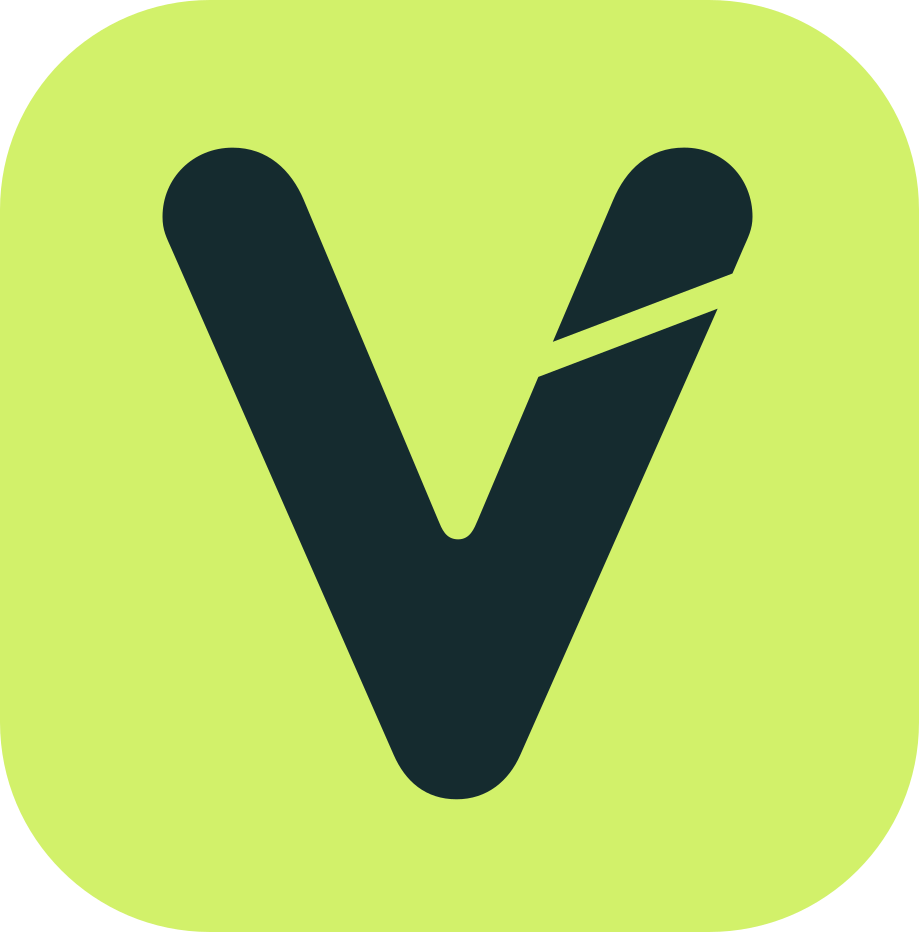
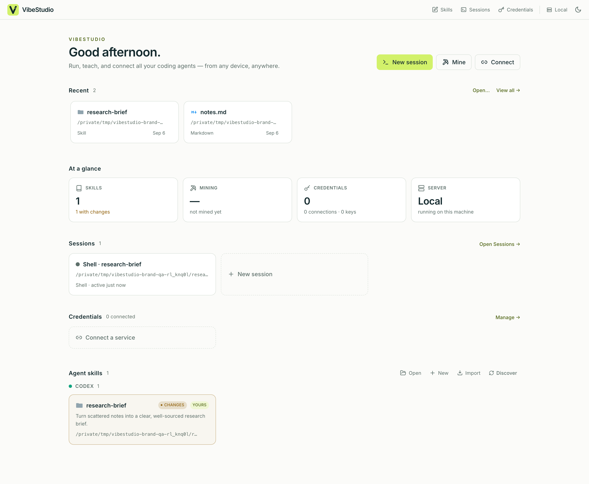

# VibeStudio

Manage the coding agents running on your machine — from anywhere. Available on macOS, Linux, Windows, iPhone, and Android.



**Download →** [macOS](https://github.com/yubinhu/vibestudio/releases/latest/download/VibeStudio-macOS.dmg) · [Windows](https://github.com/yubinhu/vibestudio/releases/latest/download/VibeStudio-Windows-x64-setup.exe) · [Linux](https://github.com/yubinhu/vibestudio/releases/latest/download/VibeStudio-Linux-x86_64.deb) — free, runs locally, no account. ([install notes](#install))

Your coding agents work best where your code, keys, and tools already live: your own machine. But you're not always sitting at it. VibeStudio is one dashboard for every agent running there — Claude Code, Codex, Cursor, Gemini CLI, opencode — driven from your desktop, a browser, or your phone.

It runs the agents and manages everything they need: the skills that carry your taste and expertise, and the credentials and MCP connections they call — versioned, synced, and kept on your own hardware.

Built with [Tauri](https://tauri.app/), it also drives any remote dev host natively, VS Code-remote style (see [`design.md`](./design.md)).

## Features

- **Run every agent from one place** — launch, watch, and resume any of them from a single dashboard. Terminals survive UI disconnect and notify you when a run finishes or needs you — locally, or on any SSH host VS Code-remote style.
- **Reach them from anywhere** — the backend serves the whole app over HTTP, so a browser or your phone drives the same agents on your machine (setup below).
- **Skill Management** — find and edit every skill across your agents in a live `SKILL.md` editor, with automatic versioning and git-remote sync as the source of truth.
- **Skill Mining** — turn past agent conversations into new skills, or fold recent ones back into existing skills.
- **Credentials & Connections** — hold the API keys your agents need and OAuth an MCP once; every agent reaches it through a local gateway, so no token ever lands in a config, environment, or transcript.

## Install

Grab the latest build for your platform:

| Platform | |
|----------|--|
| **macOS** — Apple silicon & Intel | [Download](https://github.com/yubinhu/vibestudio/releases/latest/download/VibeStudio-macOS.dmg) |
| **Windows** | [Download](https://github.com/yubinhu/vibestudio/releases/latest/download/VibeStudio-Windows-x64-setup.exe) |
| **Linux** — Debian/Ubuntu | [Download](https://github.com/yubinhu/vibestudio/releases/latest/download/VibeStudio-Linux-x86_64.deb) |

### First launch

Windows builds aren't code-signed yet, so each shows a one-time prompt:

- **Windows** — SmartScreen shows "Windows protected your PC". Click **More info → Run anyway**.
- **Linux** — install the package with `sudo apt install ./VibeStudio-Linux-x86_64.deb`.

## Use from anywhere

The backend serves the full app over plain HTTP, meaning all you need is a browser pointed at the skill-server to run the entire app — notifications included.

**On the computer:** click the **Local** pill → **Open on your phone…** → scan the QR. The app fronts its own server with [Tailscale](https://tailscale.com) (free) and walks you through the two one-time Tailscale permissions if needed. Any device signed in to your Tailscale network can open the URL; on iPhone, open it in Safari and tap **Share → Add to Home Screen** so VibeStudio can notify you when a run finishes or needs you (Apple only grants web notifications to installed apps — Android needs no extra step). 

## Build from source

Install Rust, Node.js/npm, and the [Tauri prerequisites](https://tauri.app/start/prerequisites/) for your OS, then:

```bash
git clone https://github.com/yubinhu/vibestudio.git
cd vibestudio
npm install
npm run tauri -- build
```

The built app bundle is written under `client/desktop/target/release/bundle/`.

## Development

```bash
npm install
npm run dev          # native desktop
```

| Mode | Command | Open |
|------|---------|------|
| Native desktop | `npm run dev` | the app window |
| Browser, local backend | `cargo run -p skill-server` + `npm run dev:vite` | `localhost:1420` |

## Roadmap

The thesis: the future is one where humans **collaborate** with AI agents rather than being replaced by them — so you should own and direct the agents doing your work, not rent them. Next:

1. **Team collaboration & shared secrets** — share skills, and the secrets and connections they need, across a team, account-backed.
2. **Multi-modal skills / SOP documents** in a format both humans and agents can read, for computer-use agents.
